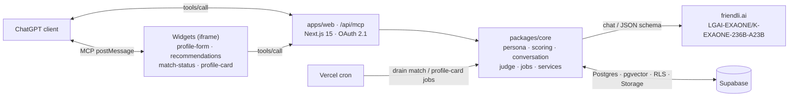

<div align="center">

# SoulSync AI

**AI 페르소나가 대신 데이트하는 ChatGPT 앱** — 사진·조건이 아니라 _대화_ 로 궁합을 확인하는 가치관 매칭

[](https://platform.openai.com/docs/apps)
[](https://modelcontextprotocol.io/)
[](https://nextjs.org/)
[](https://react.dev/)
[](https://www.typescriptlang.org/)
[](https://supabase.com/)
[](https://friendli.ai/)
[](https://vercel.com/)

**Live demo:** https://soul-sync-ai-mocha.vercel.app

</div>

---

## Overview

SoulSync AI is a **values-based compatibility matcher built as a ChatGPT App** (OpenAI Apps SDK / MCP server). A consented user profile becomes an editable **persona "agent"**. A background pipeline funnels candidates (MBTI soft-filter → religion / values / coarse-location → ranked top‑3), runs **deterministic agent-to-agent conversations** powered by **friendli.ai EXAONE**, and an **LLM‑as‑judge** scores chemistry to return **explainable, one-way recommendations**.

> The differentiator is **context-based matching** — the AIs talk _before_ you do, not photos and one-line bios.

## Features

- **ChatGPT App** — MCP server at `/api/mcp` with **OAuth 2.1** (dynamic client registration, PKCE, protected-resource metadata, `401 + WWW-Authenticate`), data tools + render tools, and in-chat widgets.
- **Context matching engine** — MBTI axis scoring + religion / values funnel with a relaxation-ladder fallback, 384‑dim embeddings + `pgvector` candidate search.
- **Agent-to-agent simulation** — deterministic A↔B persona conversation, then an **LLM judge** with a structured rubric and bias controls (order randomization).
- **Background jobs** — work is enqueued and drained by Vercel cron workers (never inline in MCP tools); completion notifications + realtime channel.
- **In-chat widgets** — `profile-form`, `recommendations`, `match-status`, `profile-card` (GGUI-generated), served as `text/html+skybridge` resources via a `window.openai` bridge.
- **Safety & privacy** — 18+ gate, granular consent ledger, block/report enforcement, account deletion + cascade, photo moderation + EXIF/GPS strip, prompt-injection sanitization, synthetic-profile labeling. No training use by default.
- **React Native–ready** — thin REST adapters at `/api/mobile/*` reuse the same `packages/core` serializers as the MCP tools.

## How it works

| # | Step | MCP tool | What happens |
|---|------|----------|--------------|
| 1 | Profile | `save_profile_step` / `save_profile_consent` | Step-by-step profile + consent saved to Supabase |
| 2 | Persona | `generate_persona` / `update_persona` | friendli.ai **EXAONE** generates a privacy-filtered persona |
| 3 | Match | `start_match_job` | MBTI / religion / values funnel + `pgvector` candidate search (background job) |
| 4 | Converse + judge | `get_match_job` (poll) | A↔B persona conversation simulated, then LLM-judged for chemistry |
| 5 | Results | `list_recommendations` / `get_profile_card` | Explainable scored, one-way recommendations + GGUI profile cards |

## Architecture



## Tech stack

| Area | Technology |
|------|-----------|
| Monorepo | pnpm workspaces (`pnpm@9.15.0`), TypeScript 5.x |
| Web / App | Next.js 15 (App Router), React 19 |
| ChatGPT App | OpenAI Apps SDK, Model Context Protocol (`mcp-handler` 1.1) |
| Auth | OAuth 2.1 (PKCE, dynamic client registration), JWT via `jose` 6 |
| LLM | friendli.ai serverless — `LGAI-EXAONE/K-EXAONE-236B-A23B` (OpenAI-compatible client) |
| Data | Supabase: Postgres + `pgvector` + RLS + Storage + Realtime |
| Validation | Zod 4 |
| Widgets | React 19 + vanilla CSS, `DOMPurify`, built with Vite 7 (library + standalone bundles) |
| Sanitization | `sanitize-html` (server), `DOMPurify` (widgets) |
| Tooling | Vitest 2, ESLint 9, Prettier 3 |
| Hosting | Vercel (cron + fluid compute) |

## Monorepo layout

```text
SoulSync_AI/
├─ apps/
│  └─ web/                      # Next.js 15 app
│     ├─ app/
│     │  ├─ page.tsx            # Landing page (this site)
│     │  ├─ components/landing/ # Hero, Problem, Solution, Tools, … sections
│     │  ├─ api/mcp/            # MCP server + tools (registry, handlers, render)
│     │  ├─ api/cron/           # match-job + profile-card-job workers
│     │  ├─ api/mobile/         # REST adapters (React Native–ready)
│     │  ├─ oauth/              # OAuth 2.1: register / authorize / token
│     │  └─ .well-known/        # OAuth metadata
├─ packages/
│  ├─ core/                     # Domain logic (framework-agnostic)
│  │  └─ src/ persona · judge · conversation · scoring · jobs ·
│  │          friendli · embeddings · identity · cardgen · services ·
│  │          serializers · seed · safety · types
│  └─ widgets/                  # In-ChatGPT React widgets + theme + bridge
├─ content/                     # 40-question spec + policy docs
├─ supabase/                    # Migrations (0001–0006), RPC, Edge Function, seed
├─ scripts/                     # e2e, seed, smoke-deploy
└─ vercel.json                  # Fluid compute + cron schedules
```

## MCP tools

**Data tools** (`apps/web/app/api/mcp/tools/registry.ts`):
`save_profile_step` · `save_profile_consent` · `generate_persona` · `update_persona` · `upload_profile_photo` · `start_match_job` · `start_profile_card_job` · `get_match_job` · `get_profile_card` · `list_recommendations` · `save_recommendation` · `report_profile` · `block_profile` · `delete_account`

**Render tools** (widget resources): `render_profile_form` · `render_recommendations` · `render_match_status` · `render_profile_card`

## Getting started

**Prerequisites:** Node.js 22.x · `pnpm` 9.15 · [Supabase CLI](https://supabase.com/docs/guides/cli) · a [friendli.ai](https://friendli.ai/) serverless API key.

```sh
# 1. Install
pnpm install --frozen-lockfile

# 2. Database (apply migrations 0001–0006 to a Supabase project)
supabase link --project-ref <project-ref>
supabase db push

# 3. Environment — create apps/web/.env.local
#    FRIENDLI_API_KEY, FRIENDLI_BASE_URL, FRIENDLI_MODEL
#    SUPABASE_URL, SUPABASE_ANON_KEY, SUPABASE_SERVICE_ROLE_KEY
#    OAUTH_ISSUER, OAUTH_AUDIENCE, CRON_SECRET, APP_BASE_URL

# 4. Dev server (web app: landing + MCP + APIs)
pnpm --filter @soulsync/web dev
```

## Scripts

| Command | Description |
|---------|-------------|
| `pnpm -r build` | Build all workspaces (`@soulsync/core`, `@soulsync/widgets`, `@soulsync/web`, `content`) |
| `pnpm -r test` | Run the Vitest suites (core, content, web) |
| `pnpm -r lint` | ESLint across workspaces |
| `pnpm e2e` | Seeded end-to-end flow with a deterministic mocked LLM (`scripts/e2e.mjs`) |
| `pnpm format` | Prettier write |

## Deployment

Deployed on **Vercel** with the Next.js app as the project root:

```text
Framework Preset : Next.js
Root Directory   : apps/web
Install Command  : cd ../.. && pnpm install --frozen-lockfile
Build Command    : cd ../.. && pnpm --filter @soulsync/widgets build && pnpm --filter @soulsync/web build
Output Directory : apps/web/.next
```

Set the production env vars (`FRIENDLI_*`, `SUPABASE_*`, `OAUTH_ISSUER`, `OAUTH_AUDIENCE`, `CRON_SECRET`, `APP_BASE_URL`), then register the MCP server in **ChatGPT Developer Mode** at `https://<app-domain>/api/mcp` (OAuth discovery via `/.well-known/oauth-protected-resource`).

See **[`DEPLOYMENT.md`](./DEPLOYMENT.md)** for the full clean-clone runbook (Supabase → friendli.ai smoke test → Vercel → ChatGPT registration → submission checklist → rollback).

## Project status

`v0.1.0` — built for the **ChatGPT Apps SDK · Weekendthon (2026.05)**.

**Known limitations:**
- Matching pool is **synthetic** (labeled `is_synthetic` on every surface) for cold-start; real users join the same funnel.
- **One-way recommendations only** — mutual-match handshakes and human-to-human chat are deferred.
- Local embeddings fall back to a deterministic 384-dim keyword vector when the Supabase `gte-small` endpoint is unavailable.
- No React Native app in v1 (architecture/adapters only).

## Documentation

- [`DEPLOYMENT.md`](./DEPLOYMENT.md) — deployment runbook
- [`RELEASE_NOTES.md`](./RELEASE_NOTES.md) — v0.1.0 scope, verification, limitations
- [`DEMO.md`](./DEMO.md) — demo flow
- [`docs/auth.md`](./docs/auth.md) — OAuth / identity model
- [`content/policies/`](./content/policies/) — privacy, AI disclosure, synthetic-profile, retention

## License

Private — © 2026 SoulSync AI · Weekendthon. All rights reserved.
